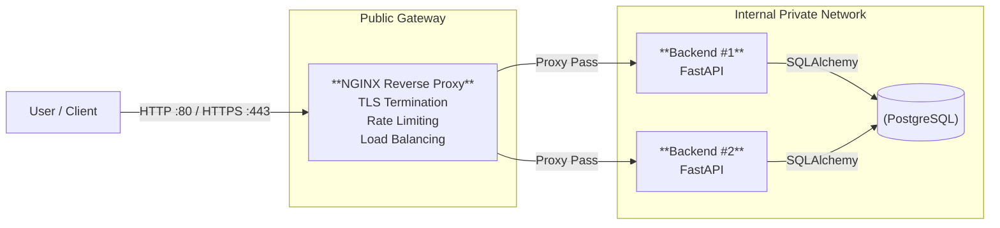

# dev-ops
Deploying a small production-style application stack using Docker and proper networking architecture.

## 1. Architecture Diagram

## 2. Request Flow

This section explains what happens when a user sends: POST /sum

1️. DNS

User sends:
https://localhost/sum

localhost resolves to 127.0.0.1

The request goes to port 443

2️. Port Routing

In Docker:

ports:
  - "80:80"
  - "443:443"

So:

Host port 443 → NGINX container 

Host port 80 → NGINX container

The request first reaches Reverse Proxy which is NGINX.

3️. Reverse Proxy 

NGINX:

- Handles HTTPS (TLS)

- Logs the request

- Applies rate limiting (if enabled)

Forwards the request to backend

It forwards to: backend:8000

4️. Docker Internal DNS

We run: docker compose up --scale backend=2

Scaling is done here.

So Docker creates:

- backend-1

- backend-2

When NGINX sends request to backend,
Docker automatically chooses one of the backend containers which is load balancing.

5️. Backend Processing

The selected backend:

- Validates input

- Calculates:
result = a + b

- Connects to database

- Stores the request and result

6️. Database Connection

- Backend connects using: POSTGRES_HOST=db

- Docker resolves db to the PostgreSQL container internally.

- Database saves the data.

7️. Response Back

The response goes back:

Database → Backend → NGINX → User

User receives:

{
  "result": result
}

## 3. Networking Explanation

### Service Exposure Strategy

- proxy (NGINX) is the only service exposed to the host:

    - 80:80 (HTTP)

    - 443:443 (HTTPS)

- backend (FastAPI) does not publish any ports to the host. It is reached only through NGINX over Docker networking.

- db (PostgreSQL) does not publish any ports to the host. It is reachable only from containers on the DB network.

### Services which are internal only

1. backend : it is attached to internal_net and db_net and has no host port mapping.

2. db: it is attached only to db_net.

internal_net and db_net are marked as internal: true, meaning Docker will not route external traffic into them.

### Containers communication

- User → proxy: via host-mapped ports 80/443.

- proxy → backend: via Docker DNS service discovery using the service name backend (NGINX upstream points to backend:8000). When you scale, Docker DNS resolves backend to multiple backend container IPs.

- backend → db: via the service name db on port 5432, using the shared db_net.

Only the reverse proxy is exposed to the outside to enforce a single controlled entry point for:

- TLS termination

- rate limiting

- request logging

- load balancing

Keeping backend and db unexposed reduces the attack surface and prevents direct access to application and database ports from outside the Docker network.

## 4. Security Considerations
### Why the database is not exposed

The PostgreSQL service has no host port mapping (no ports: in Compose). Only backend containers on the internal db_net can reach it. This prevents anyone from connecting to the database directly from the host or internet.

### Why the backend is not public

The FastAPI backend also has no host port mapping.
All traffic must go through the NGINX reverse proxy.
This makes NGINX the single controlled entry point where we can enforce TLS, rate limiting, and logging.

### What risks are reduced

By keeping DB and backend private, we reduce:

- Direct attacks on PostgreSQL (password brute-force, scanning, exposed admin ports).

- Bypassing security controls (users cannot skip NGINX rate limiting / logging).

- Larger attack surface (fewer exposed ports = fewer targets).

- Accidental access (developers/users cannot hit DB/backend directly from outside the Docker networks).

- Impact of compromise (even if NGINX is targeted, internal services remain isolated behind private networks).